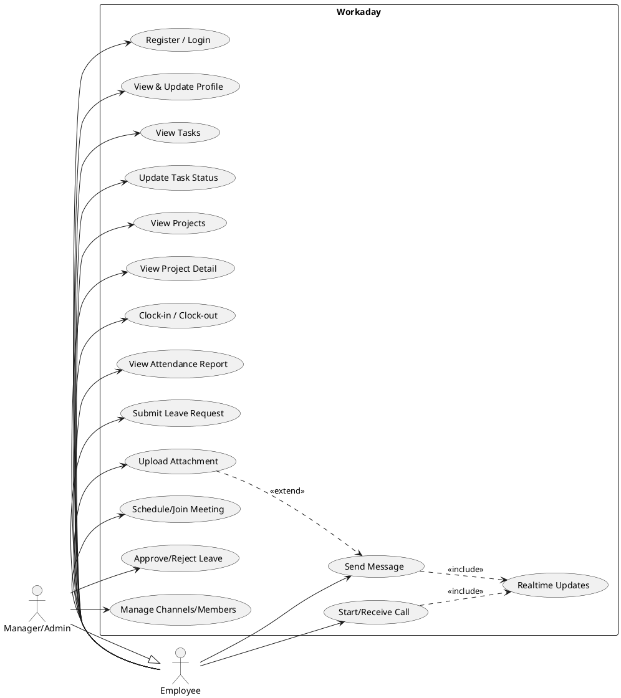

# Workaday System Overview

Tài liệu này mô tả **tech stack** (Frontend + Backend), **kiến trúc hệ thống end‑to‑end**, và **use case diagram** (PlantUML) của toàn bộ hệ thống Workaday.

## 1) Tech Stack

### Frontend (Mobile App)
- **Framework**: React Native (Expo)
- **Language**: TypeScript
- **Navigation**: React Navigation (stack/tabs/drawer)
- **State management**: Zustand
- **Networking**: Axios (API client)
- **Realtime**: `socket.io-client`
- **Push notifications**:
  - Expo Notifications
  - Notifee (hiển thị/thao tác notification nâng cao)
  - Firebase Cloud Messaging (một số flow/thiết bị)
- **Voice/Video calling**: Agora SDK (tuỳ nền tảng)
- **Android incoming call plumbing**: native/module glue cho trải nghiệm cuộc gọi đến

### Backend (API + Realtime)
- **Runtime**: Node.js
- **Language**: TypeScript
- **Web framework**: Express
- **Database**: MongoDB
- **ODM**: Mongoose
- **Auth**: JWT (đăng nhập/đăng ký + middleware auth)
- **Realtime**: Socket.IO
- **File/Media**: Cloudinary (upload/attachment)
- **Push notifications**:
  - Expo Push (Expo tokens)
  - Tuỳ chọn FCM (device tokens)
- **Calling**: Agora token / call coordination (tích hợp qua routes/services)

### Shared / Ops
- **Build**: `tsc` (TypeScript build)
- **Process**: chạy Node server (thường qua npm scripts)
- **Config**: `.env` / `.env.example`

## 2) System Architecture (High-level)

### Thành phần chính
- **Mobile App**: UI + local state + gọi API + nhận push + realtime socket
- **Backend API**: REST endpoints theo module (auth/chat/tasks/projects/attendance/leave/...) + upload + push + call
- **Realtime Gateway**: Socket.IO (thường chạy chung process với API server)
- **MongoDB**: lưu trữ dữ liệu nghiệp vụ
- **External Services**:
  - **Cloudinary**: lưu trữ ảnh/tệp đính kèm
  - **Expo/FCM**: đẩy push notification
  - **Agora**: voice/video calling

### Luồng giao tiếp chính
1) App đăng nhập → nhận JWT → gọi các API có auth
2) App kết nối socket (kèm userId/token) → nhận sự kiện realtime (chat/call/state)
3) Khi có sự kiện quan trọng (tin nhắn mới, nhắc việc, phê duyệt nghỉ, ...)
   - Backend gửi push qua Expo/FCM
   - App hiển thị bằng Notifee/Expo Notifications
4) Upload file/attachment
   - App gửi file → Backend upload middleware → Cloudinary → lưu URL vào MongoDB

### Mermaid architecture diagram (flowchart)
```mermaid
flowchart LR
  subgraph Client[Mobile App (Expo / React Native)]
    UI[UI Screens]
    Store[Zustand Stores]
    Push[Push Handler\n(Expo Notifications / Notifee / FCM)]
    RT[Socket.IO Client]
    APIClient[Axios API Client]
  end

  subgraph Server[Backend (Node.js / Express / TS)]
    REST[REST Routes\n(auth/chat/tasks/...)]
    Auth[Auth Middleware\n(JWT)]
    Realtime[Socket.IO Server]
    Upload[Upload Middleware]
    PushSvc[Push Services\n(Expo/FCM)]
    CallSvc[Call/Agora Services]
  end

  DB[(MongoDB)]
  Cloudinary[(Cloudinary)]
  Expo[(Expo Push)]
  FCM[(Firebase Cloud Messaging)]
  Agora[(Agora)]

  UI --> Store
  UI --> APIClient --> REST
  UI --> RT --> Realtime
  Push --> UI

  REST --> Auth
  REST --> DB
  Realtime --> DB

  REST --> Upload --> Cloudinary
  REST --> PushSvc --> Expo
  REST --> PushSvc --> FCM
  REST --> CallSvc --> Agora

  Cloudinary -. URLs .-> DB
```

## 3) Domain Modules (Backend/Frontend features)

Các module chính (theo cấu trúc routes/models/services trong backend và screens/services/store trong mobile):
- **Auth & Users**: đăng ký/đăng nhập, profile, quyền/role
- **Company/Department/Workforce**: tổ chức, phòng ban, nhân sự
- **Tasks & Projects**: quản lý công việc/dự án, trạng thái, chi tiết
- **Attendance**: chấm công (clock-in/clock-out), báo cáo
- **Leave**: tạo đơn nghỉ, duyệt/từ chối, theo dõi trạng thái
- **Chat**: channels/messages, member management, attachments
- **Notifications & Push tokens**: đăng ký token, gửi thông báo
- **Meetings**: tạo/nhắc lịch họp
- **Documents/Upload**: upload tài liệu/ảnh đính kèm
- **Calls**: flow gọi/nhận cuộc gọi, tạo token Agora, realtime state

## 4) Use Case Diagram (PlantUML)

Ghi chú:
- Sơ đồ tập trung vào nghiệp vụ chính, không mô tả chi tiết màn hình.
- Actor **Employee** là người dùng thông thường; **Manager/Admin** có thêm quyền duyệt và quản trị.
- Các dịch vụ bên thứ ba (Cloudinary/Expo/FCM/Agora) là **implementation detail** và đã được thể hiện ở phần **System Architecture**; vì chúng không “khởi tạo” use case theo nghĩa nghiệp vụ, sơ đồ use case bên dưới chỉ tập trung vào mục tiêu của người dùng.



## 5) Notes / Assumptions
- “Frontend” trong tài liệu này là **mobile app** (Expo/React Native). Nếu sau này có web admin riêng, có thể bổ sung thêm.
- Push có thể đi qua **Expo Push** hoặc **FCM** tuỳ nền tảng/token; backend có module quản lý push tokens và dịch vụ gửi.
- Realtime dùng Socket.IO để đồng bộ trạng thái chat/call/notification badge.
